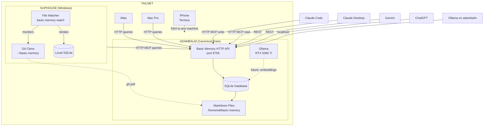

## Summary

Established canonical architecture for cross-machine, multi-model AI memory system. All LLM queries route to adambalm as the single source of truth. Local machines maintain file copies via git for backup and offline browsing only.

## Decision Date
2025-11-26

## Status
Canonical

## Participants
- Ed O'Connell (Human Orchestrator)
- Claude Opus 4.5 (Architecture discussion)
- Claude Code (Diagnostics and verification)
- Gemini 2.0 Flash (Initial consultation - partially incorrect, prompted deeper investigation)

---

## Architecture


**Current Flow (2025-12-03):**
1. Claude Code writes to adambalm via HTTP MCP
2. Git push from adambalm to GitHub
3. Git pull on suphouse (manual trigger)
4. File watcher detects changes, reindexes local SQLite
5. Claude Desktop reads from adambalm via HTTP MCP (canonical) OR local SQLite (if available)
## Key Decisions

- [decision] adambalm is the single source of truth for all AI memory queries #architecture
- [decision] Basic Memory HTTP server runs on adambalm port 8765 using streamable-http transport #infrastructure
- [decision] Other machines query adambalm over Tailnet; they do not run their own MCP servers #architecture
- [decision] Git sync retained for file backup and offline Obsidian browsing, not for database sync #operations
- [decision] Offline strategy is simple: browse files in Obsidian, use Cmd+Shift+F to search, wait for connectivity #operations
- [decision] No complex offline fallback or local database sync - overengineering for a rare use case #architecture

---

## Technical Specifications

### Server Command (adambalm)
```bash
~/.local/bin/uvx basic-memory mcp \
  --transport streamable-http \
  --port 8765 \
  --host 0.0.0.0
```

### Available Endpoints
- `/mcp` - MCP protocol (for Claude)
- `/main/search/` - REST search endpoint
- `/main/knowledge/entities` - Entity CRUD
- `/main/memory/recent` - Recent activity
- `/docs` - Swagger UI (interactive API docs)

### Client Configuration (suphouse, etc.)
```json
{
  "mcpServers": {
    "basic-memory-adambalm": {
      "type": "http",
      "url": "http://100.111.114.84:8765/mcp"
    }
  }
}
```

---

## Rationale

### Why Centralized?
- One source of truth eliminates sync conflicts
- Ollama on adambalm can generate embeddings locally (future)
- Vector store (future) lives on same machine as inference
- Simpler than distributed sync

### Why HTTP over MCP-only?
- MCP is Claude-ecosystem specific
- HTTP REST allows any LLM (Gemini, ChatGPT, Ollama) to access memory
- Standard protocol, no vendor lock-in

### Why Keep Git?
- Version control for rollback
- Backup if adambalm fails
- Human browsing in Obsidian without network dependency

---

## What This Enables (Control Plane Vision)

- [concept] Multi-model memory access - any LLM can query the same knowledge base #capability
- [concept] Decision logging with provenance - canonical record of what was decided and why #capability
- [concept] Protocol enforcement - Black Flag, Lanesborough accessible to all agents #capability
- [concept] Human approval gates - writes can require human sign-off #capability

---

## IMPLEMENTATION STATUS
**Updated:** 2025-12-03

### ✅ OPERATIONAL (as of 2025-12-03)

- [x] HTTP MCP server running on adambalm:8765 (started 2025-12-02T20:08:44)
- [x] Claude Code → adambalm via HTTP MCP (write operations tested)
- [x] Claude Desktop (suphouse) → adambalm via HTTP MCP (read operations tested)
- [x] File watcher running on suphouse (PID 11572, started 2025-12-02T20:08:44)
- [x] Manual git sync operational: adambalm push → suphouse pull
- [x] File watcher auto-reindex after git pull (tested 2025-12-03T03:34:47)
- [x] Full round-trip validated: Code writes → git push → manual pull → auto-index → Desktop reads

### ✅ PREVIOUSLY IMPLEMENTED

- [x] Protocols (Black Flag, Temporal Validity, Lanesborough) in Basic Memory
- [x] Bootstrap document (`BOOTSTRAP.md`)
- [x] Git repository with GitHub remote
- [x] Frontmatter standardization

### ⚠️ OPERATIONAL NOTES

- File watcher uptime: ~7 hours (needs long-term stability testing)
- No monitoring/alerting on file watcher or HTTP server failures
- Git sync requires manual pull on suphouse after adambalm push
- No automated conflict resolution
- Performance under load untested

### ⏳ PENDING (Future Implementation)

- [ ] Systemd service for persistent HTTP server (currently manual start)
- [ ] Systemd service for file watcher (currently manual start)
- [ ] Automated git sync (currently requires manual pull on suphouse)
- [ ] Monitoring and alerting for service failures
- [ ] REST API testing from non-Claude clients (Gemini, ChatGPT)
- [ ] Conflict resolution strategy
- [ ] Embedding/vector store integration
---

## Relations

- implements [[Cross-Machine AI Context Persistence - Implementation Specification]]
- supersedes distributed sync approach documented in that spec
- enables [[Lanesborough Protocol]] by providing shared context
- enables [[Black Flag Protocol]] by providing verifiable decision log
- runs_on [[Adambalm Server - Complete System Specifications]]
- accessed_from [[Suphouse (Asus Vivobook) - Complete System Specifications]]

---

## Context

This decision emerged from a troubleshooting session where:
1. Git repos had diverged between machines
2. Basic Memory databases were out of sync
3. Gemini consultation revealed misunderstandings about Black Flag and Lanesborough protocols
4. Investigation showed Basic Memory 0.16.2 has built-in HTTP server capability
5. Discussion clarified that the real value is the control plane (protocols, decisions, approvals), not the storage plumbing

The offline complexity we initially designed was overengineering. Simple git + Obsidian search is sufficient for rare offline scenarios.
